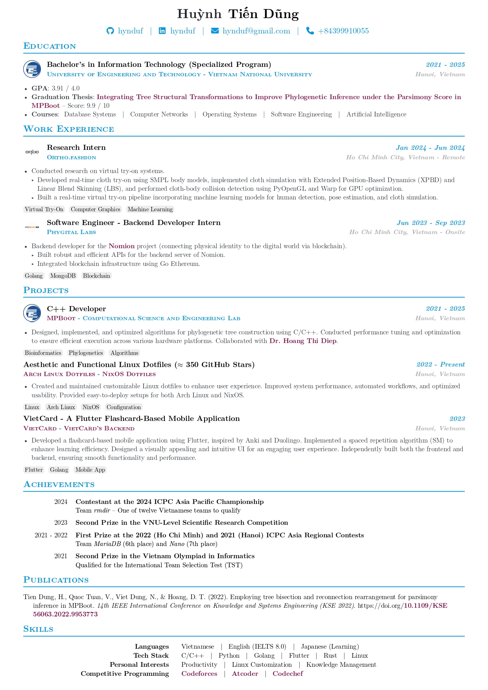

# Typst CV

- This is a heavily-customized Typst CV template by [https://github.com/mintyfrankie/brilliant-CV](https://github.com/mintyfrankie/brilliant-CV) (so heavily that the usage is even different 😄). See the original template to see what it can do.

- I only customized it to be exactly like I wanted so it might not be as **customizable** as the original template.

## How to use

1. Change your personal data in `template/metadata.toml` and `template/module_*/`.

2. See `main.typ` for CV structure and `main_letter.typ` for cover letter. Change it to however you like.

3. Run commands to generate `main.pdf` and `main_letter.pdf` respectively.
    ```typst
    typst compile main.typ
    ```

    ```typst
    typst compile main_letter.typ
    ```

## Preview

### CV

<div>

</div>

### Cover Letter

<div>

</div>

